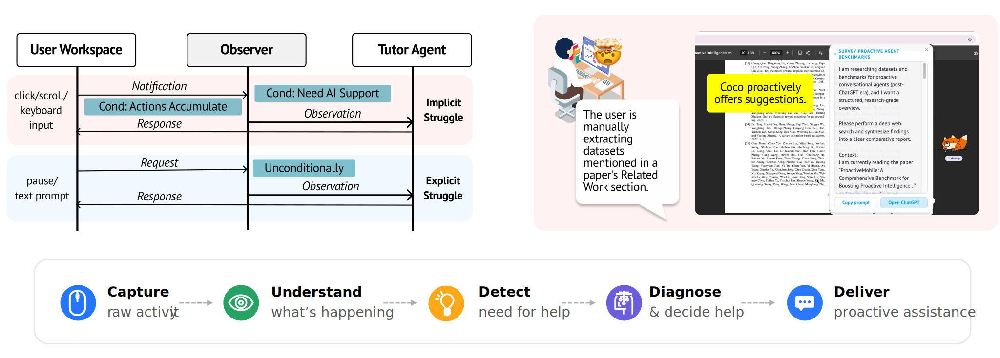

<p align="center">
  
</p>


**Proactive Co-Assistant Through Continuous Context Observation**

Coco quietly senses your computer-use context and steps in with the right help at the right moment — a nudge when you're stuck, a better AI tool to delegate to, or a hint to learn something yourself. Runs **fully on your machine** as a lightweight desktop app.

## What it solves?
Working with AI today puts most of the burden on the human: you have to notice when AI could help, know what to ask, and supply all the context yourself. Coco inverts that:

- **Proactively identifies opportunities** — recognizes repetitive work and generates a ready-to-send prompt so you can delegate in one shot
- **Accumulates context across apps** — infers your intent from browsing, reading, and editing history rather than waiting for you to explain it
- **Helps you discover what you don't know** — surfaces concrete questions when you're struggling with unfamiliar territory, so you can ask the right things

Coco is a *collaboration layer* that sits between you and the AI tools you already use. We keep it intentionally lightweight in order to decouple proactive co-assistance from the execution capabilities provided by various general and vertical agents.

## Demos

**Automating repetitive work**


> The user is skimming a paper's Related Work section to find datasets about proactive agents. Coco recognizes the repetitive lookup pattern and generates a detailed prompt the user can send to ChatGPT in one shot.

**Summarizing browsing content based on inferred intent**


> The user searches for a church in San Diego, checks travel time, and reads Yelp reviews. Coco infers a potential day-trip and surfaces a plan — no prompt needed.

**Helping user to navigate unknown unknowns**


> The user wants to run Nemotron-3-Nano-Omni locally but doesn't know what hardware specs matter. Coco senses the struggle and suggests concrete questions that are at the core of the space.


## Quickstart

```bash
# 1. Clone
git clone https://github.com/collaborative-agents/coco.git
cd coco

# 2. Configure model and API key
cp .env.example .env
#   then edit .env

# 3. Install packages for the Python services
uv sync

# 4. Launch the desktop app
cd desktop
npm install
npm start
```


## How it works

<p align="center">
  
</p>

Coco continuously observes user actions and decides when to offer proactive suggestions using a VLM. It has three main components:

- **Desktop app (Electron)** — the avatar that lives on your desktop. Assistance surfaces as a small bubble with minimal screen footprint.
- **Sensing service (`:8080`)** — the observer. `lib/sensing` implements the Computer Use Behavior Observation Protocol, which specifies how behavioral signals from your desktop are captured, classified, and forwarded to downstream agents.
- **Tutor service (`:8081`)** — the helper. `lib/proactive_tutor` implements the Tutor Agent, which diagnoses each observation and decides what to do — a hint, a nudge, or a delegation prompt — then returns the guidance shown in the bubble or chat.


## Data & privacy

Coco collects nothing — no telemetry, no analytics, no Coco servers. For a full breakdown of each component's inputs/outputs, the data-flow diagram, every file Coco writes to disk, and exactly what is sent to the VLM, see [PRIVACY.md](PRIVACY.md).

### What stays on your machine


Everything Coco stores about you (settings, activity history, session records) lives in the app's user-data folder:

- **macOS**: `~/Library/Application Support/coco`
- **Windows**: `%APPDATA%\coco` (e.g. `C:\Users\<you>\AppData\Roaming\coco`)
- **Linux**: `$XDG_CONFIG_HOME/coco` or `~/.config/coco`

Screenshots are deleted the moment the observer has read them, so nothing accumulates on disk. If you want to save the screenshots for potential training purposes, set `COLLECT_TRAINING_SCREENSHOTS=1` in `.env`, and they'll be copied into the records folder before deletion (disk-heavy — enable it deliberately).

### VLM Calls

While Coco application is fully local, the observer involves the VLM call: it sends **screenshots of your screen** to whichever VLM you select, so your provider choice determines where those pixels go. We are working on making Coco on-device naitive. Right now, we recommend:
- Self-hosted VLMs, e.g., via [vLLM](https://github.com/vllm-project/vllm), [LM Studio](https://lmstudio.ai/)
- Trusted Execution Environment (TEE) providers — open-weight models hosted on attested secure hardware, e.g. [Tinfoil](https://tinfoil.sh/)
- [Unlinkable inference](https://openanonymity.ai/blog/unlinkable-inference/) — relays requests to any model provider while adding confidentiality, e.g. [Open Anonymity](https://chat.openanonymity.ai/)

See [lib/external_api/README.md](lib/external_api/README.md) for model provider configuration.


## Acknowledgement

We thank Long Lin for designing the avatar. The screen-capture and observation-storage core builds on the [GUM (General User Models) project](https://github.com/GeneralUserModels/gum).


## Contact

Coco is under active development — we'd love to hear from you.

Whether you've found a bug, have a feature idea, or want to collaborate, reach out at [`shaoyj@stanford.edu`](mailto:shaoyj@stanford.edu).

## License

Apache License 2.0 — see [LICENSE](LICENSE).
